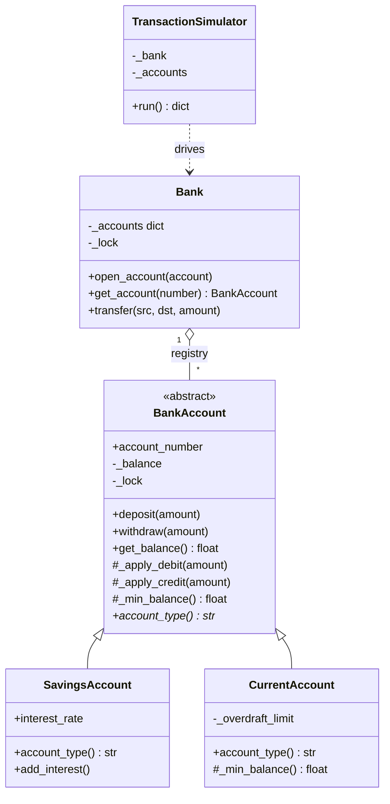
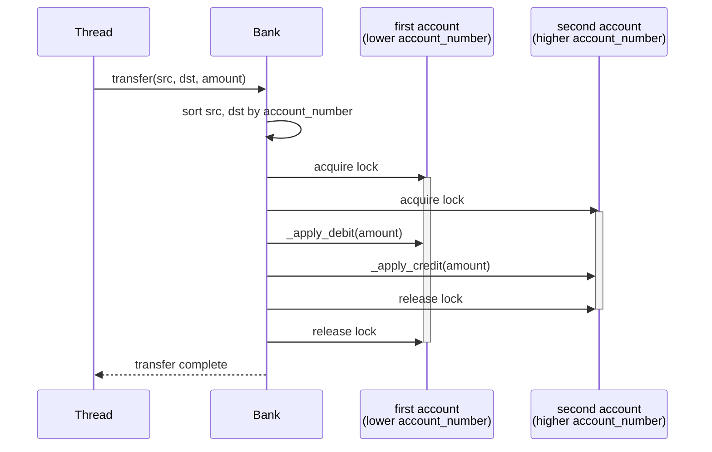
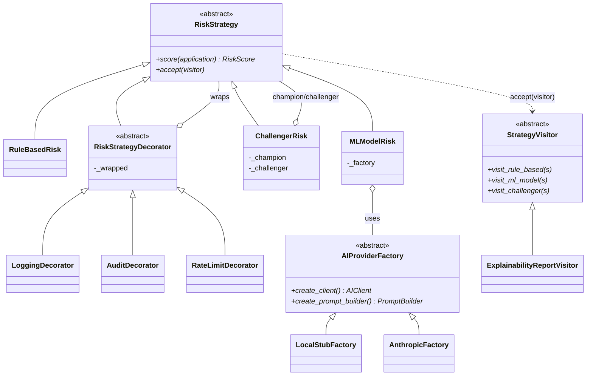

# Architecture Diagrams

## 1. Unit 6: Banking system class diagram

## 2. Unit 6: `Bank.transfer()` lock-acquisition sequence

Shows the deadlock-prevention mechanism: both locks are always acquired in
the same order (lower `account_number` first), regardless of transfer
direction, which is what makes two simultaneous reverse transfers safe.

## 3. creditguard: Pattern relationships

